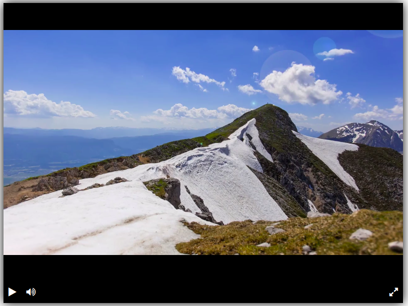

# Вёрстка простого плеера

Мониторит изменение `index.html` и показывает свёрстанный плеер по адресу [127.0.0.1:5500](http://127.0.0.1:5500). Пример можно посмотреть на [github pages](https://n1k0din.github.io/player).



## Установка и запуск

1. Скачайте код и перейдите в папку проекта
  ```bash
  git clone https://github.com/n1k0din/player.git
  ```  
  ```bash
  cd player
  ```
2. Установите вирт. окружение
```bash
python -m venv venv
```
3. Активируйте
```bash
venv\Scripts\activate.bat
```
 или
 ```
 source venv/bin/activate
 ```
4. Установите `livereload`
```bash
pip install -r requirements.txt
```
5. Запустите
```bash
livereload .
```

6. Наслаждайтесь по адресу [127.0.0.1:5500](http://127.0.0.1:5500).
